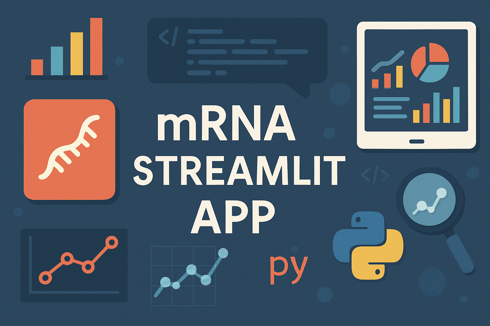

# Streamlit_App_SQL_Python_mRNA_BioPharma
# 🧬 mRNA Biopharma Streamlit App

**An interactive, multi-page Streamlit app for exploring synthetic data on mRNA-based vaccine trials, shipments, contracts, coverage, and adverse events. Built for non-coders in pharmaceutical and public health roles.**



[](https://share.streamlit.io/your-username/SQL_Tableau_mRNA_BioPharma_DB/main/app.py)


---

## 📊 What This App Does

This no-code-friendly app helps:
- 💉 **Pharmacists** track vaccination coverage, shipments, and second-dose drop-offs.
- 🧪 **Medical officers** analyze clinical trial data, efficacy, and adverse events.
- 📈 **Market analysts** estimate revenue, price per dose, and country comparisons.
- 🌍 **Country leads** monitor vaccine delivery performance and population impact.

## 🧱 Tech Stack

| Area               | Tools Used                                   |
|--------------------|-----------------------------------------------|
| Frontend UI        | Streamlit (multi-page app)                    |
| Backend Database   | MySQL (schema + synthetic CSVs)               |
| Visualization      | Plotly, PyDeck, Streamlit native charts       |
| Geospatial Mapping | `st.map`, `pydeck` with lat/lon coordinates   |
| Exporting Views    | PDF Export using ReportLab                    |

---

## 🚀 Try It Live

👉 **Hosted App:** [Streamlit Cloud]
```arduino
https://camontefusco-mrna-dashboard.streamlit.app
```
> _No coding required. Built for business users._

---

## 🧰 Features

- ✅ CRUD (Create, Read, Update, Delete) operations on all major entities
- 🗂 Dashboard navigation across Vaccinations, Trials, Events, Shipments
- 📅 Date filters and range pickers on all charts
- 🌍 Geo Maps showing vaccine coverage and event severity by country
- 🧠 Context-aware dropdowns (e.g., country names pulled from database)
- 💬 Hover tips (`st.help`) and inline popovers (`ℹ️`) for guidance
- 🧾 Export filtered views to PDF
- 🔒 Input validations for safe, non-technical user experience

---

## 🧑‍💼 Example Business Questions Answered

| Role             | Sample Question                                                   |
|------------------|-------------------------------------------------------------------|
| Country Lead     | Which countries have the lowest coverage or delayed shipments?    |
| Medical Officer  | Are severe adverse events more frequent in specific age groups?   |
| Market Analyst   | Which contracts generated the most revenue per capita?            |

More insights in the `/docs/business_questions.md`.

---

## 📂 Folder Structure
```bash
📦mRNA_BioPharma_App
├── /app/
│ ├── Home.py
│ ├── Create.py
│ ├── Read.py
│ ├── Update.py
│ ├── Delete.py
│ ├── Visualize.py
│ └── Map.py
├── /data/
│ ├── synthetic_countries.csv
│ ├── synthetic_contracts.csv
│ ├── synthetic_clinical_trials
│ ├── synthetic_shipments
│ ├── synthetic_vaccinations
│ └── adverse_events
├── /sql/
│ ├── schema.sql
│ ├── stored_procedures.sql
│ └── sample_queries.sql
├── requirements.txt
└── README.md
```

```yaml
## ⚙️ Local Setup

### ✅ Prerequisites

- Python 3.9+
- MySQL or SQLite
- Streamlit: `pip install streamlit`
```
### ▶️ Run App Locally

```bash
git clone https://github.com/camontefusco/SQL_Tableau_mRNA_BioPharma_DB.git
cd SQL_Tableau_mRNA_BioPharma_DB
pip install -r requirements.txt
streamlit run app/Home.py
```

## ☁️ Deploy to Streamlit Cloud
1. Push your repo to GitHub
2. Go to streamlit.io/cloud
3. Connect your repo and choose app/Home.py as the entry point
4. Enjoy your app — it auto-deploys on every Git push

## 🧪 Sample SQL Query
```sql
-- Total contracted revenue by country
SELECT country_name, SUM(total_doses * price_per_dose) AS total_revenue
FROM Contracts
JOIN Countries USING (country_id)
GROUP BY country_name;
```

## 🤝 Contributing
Pull requests welcome! For major changes, open an issue first to discuss what you’d like to change.

## 📬 Contact
Carlos Montefusco
📧 cmontefusco@gmail.com
🔗 GitHub: /camontefusco

## 📄 License
MIT License

Built with ❤️ using Python, Streamlit, SQL, and lots of open-source data inspiration.
